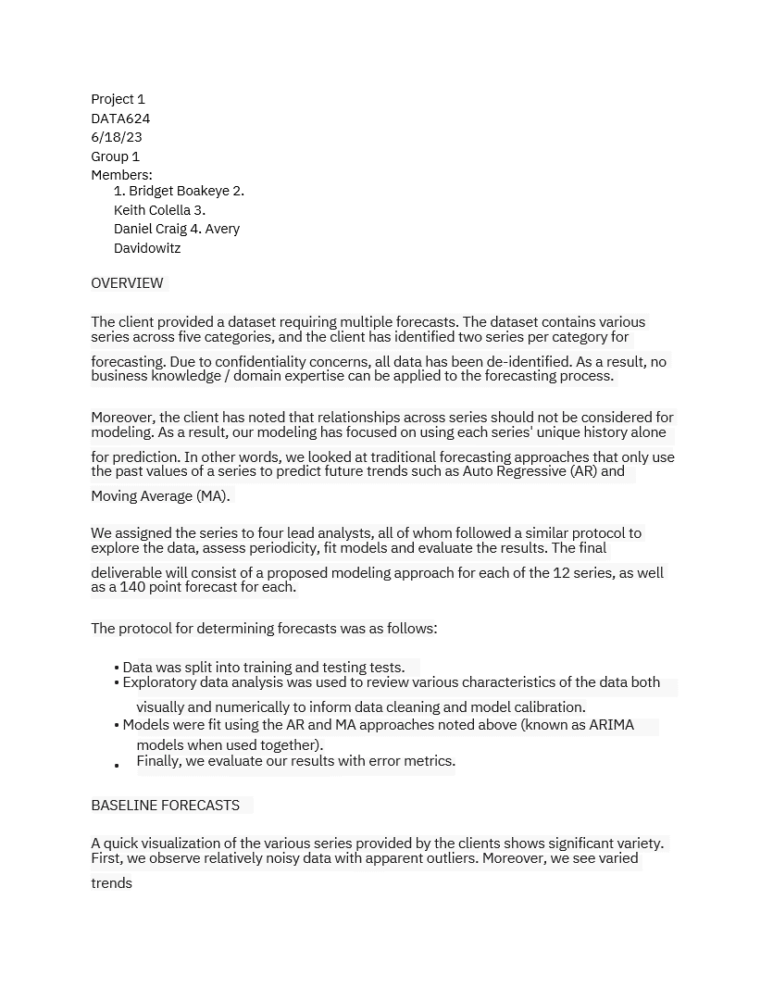
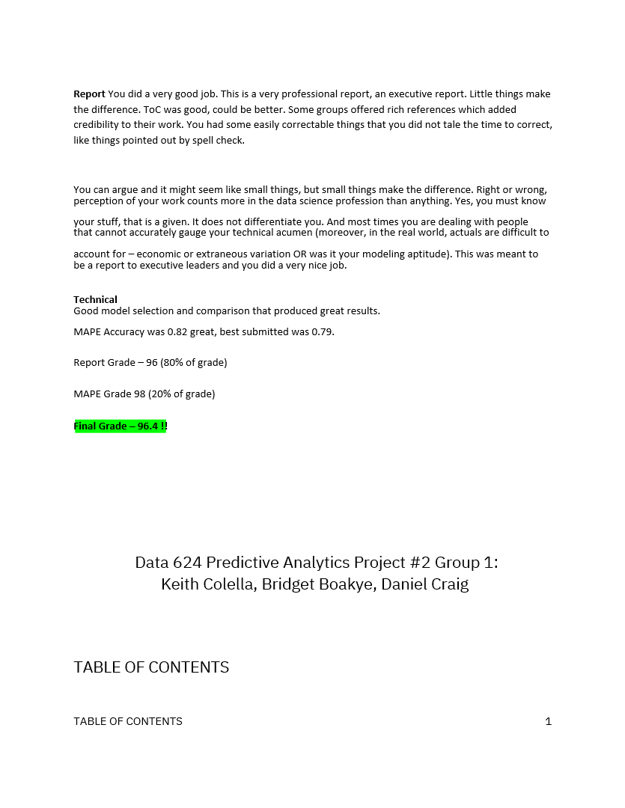

# DATA624 Predictive Analytics

This course covered basic forecasting and prediction techniques including Auto-Regressive, Moving Averages, ARIMA, and other methodologies found in machine learning, such as RandomForests, SVMs, and Neural Nets.

The course focuses on two projects in a group setting with a heavy focus on "executive summary" type reports.

# Project 1: Forecast on 12 unidentified timeseries using ARIMA and ETS modeling
There were 6 categories of variable, S01 - S06 with two variables in each.

## Forecast Results (comments from instructor)
a.	S01 MAPE 11.7% and 27.8% (very good)

b.	S02 MAPE 10.0% and 36.2% (middle Var02, best var03)

c.	S03 MAPE 7.5% and 8.6% (best var05 and var07)

d.	S04 MAPE 11.0% and 43.7% (very good)

e.	S05  MAPE 5.8% and 29.0% (worst var02, tied var03)

f.	S06 MAPE 5.5% and 5.7% (very good)

g.	Report Grade – 94, Accuracy 97, overall is 94.9.   

[P1_PDF](Project_1/P1_Report.pdf)

# Project 2: Predict pH values of a beverage dataset (2751 x 33)

## Forecast Results (comments from instructor)
Good model selection and comparison that produced great results.  
MAPE Accuracy was 0.82 from your group, the best submitted was 0.79.

Report Grade – 96 (80% of grade)

MAPE Grade 98 (20% of grade)

Final Grade – 96.4 !! 

[P2_PDF](Project_2/Project_2_feedback.pdf)
